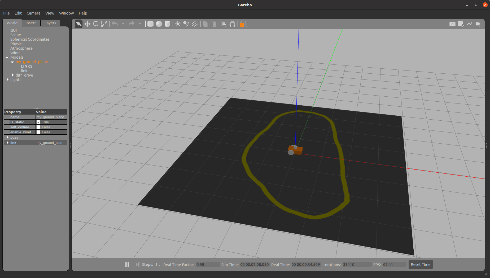
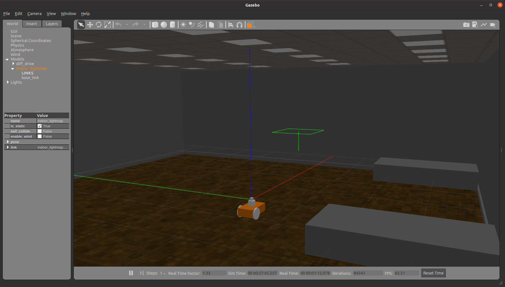
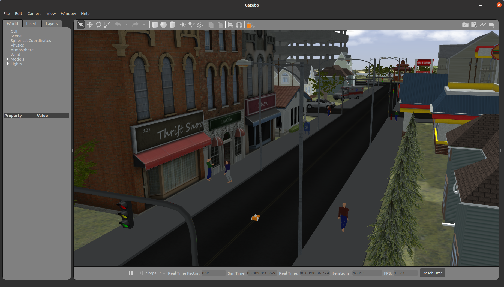

## ROSBot

### Build

```
$ cd catkin_ws/src
$ git clone https://github.com/wuhanstudio/rosbot
$ cd ..
$ catkin_make
$ source devel/setup.sh
```

### Lane Tracking

```
$ roslaunch rosbot lane.launch
```



### Small Office

```
$ roslaunch rosbot office.launch
```



### Small Town

```
$ . /usr/local/share/citysim/setup.sh
```

```
$ roslaunch rosbot city.launch
```

